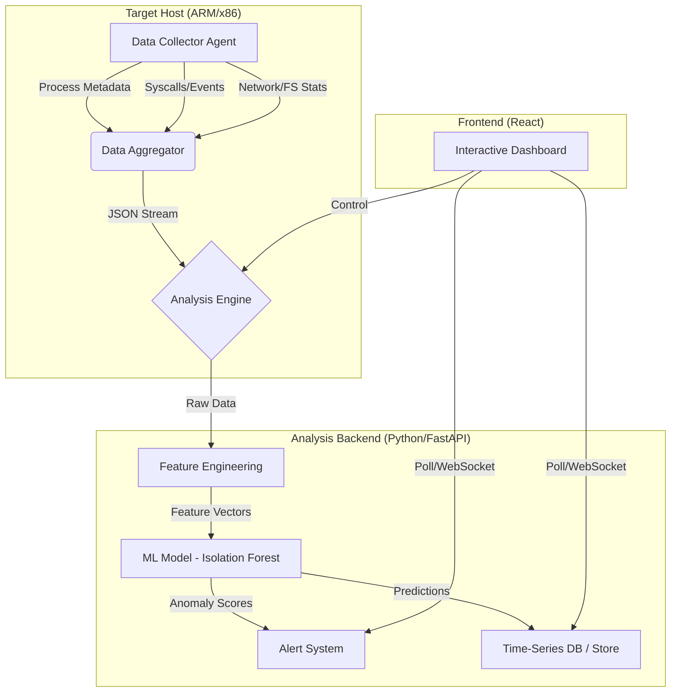

# Defensive Rootkit Monitoring Tool

## High-Level Architecture

The system is designed as a distributed monitoring solution with a centralized analysis dashboard.

## Module Description

1.  **System Monitoring Module**: Uses `psutil` for cross-platform process metrics and platform-specific hooks (simulated or wrappers around `strace`/`ltrace` for demonstration).
2.  **ML Integration**:
    -   **Feature Engineering**: Extracts temporal (process duration), statistical (syscall counts), and behavioral features.
    -   **Model**: Uses `IsolationForest` for unsupervised anomaly detection.
3.  **Interactive Dashboard**: A modern, glassmorphic UI built with React and Tailwind CSS to visualize real-time threats.

## Testing & Validation Guide

### 1. Simulation
Deploy a benign "rootkit" simulator.
-   **Linux**: Create a script that uses `LD_PRELOAD` to hook `open` or `readdir`.
-   **Method**: Run the monitor, then inject the hook. Observe the "Anomaly Score" spike in the dashboard.

### 2. Red Teaming
Simulate a covert channel:
-   Start a process that beacons to an unusual port every 10 seconds.
-   The ML model should flag the periodicity and unusual port usage.

### 3. Baseline Drift
-   Run the tool for 1 hour of normal usage to build a baseline.
-   Install a new heavy application (e.g., a compiler or game).
-   Observe initial alerts, then retrain the model via the dashboard to adapt.

## Setup & Running

### Backend
1.  Navigate to `backend/`.
2.  Install dependencies: `pip install -r requirements.txt`.
3.  Run the server: `python main.py`.
    -   API will be available at `http://localhost:8000`.

### Frontend
1.  Navigate to `frontend/`.
2.  Install dependencies: `npm install`.
3.  Run the dev server: `npm run dev`.
4.  Open `http://localhost:5173` to view the dashboard.
